<div align="center">

# 🔄 Continuous Integration Demo


<p align="center">
  <em>A hands-on demonstration of Continuous Integration practices using GitHub Actions, automated testing, and code linting.</em>
</p>

---

[Features](#-features) •
[Quick Start](#-quick-start) •
[Project Structure](#-project-structure) •
[CI Pipeline](#-ci-pipeline) •
[Contributing](#-contributing)

---

</div>

## ✨ Features

| Feature | Description |
|---------|-------------|
| 🧪 **Automated Testing** | Unit tests using Python's `unittest` framework with comprehensive coverage |
| 🔍 **Code Linting** | PEP8 compliance checking with `flake8` |
| 🚀 **Multi-Platform CI** | Runs on Ubuntu, Windows, and macOS simultaneously |
| 🐍 **Multi-Version Support** | Tests across Python 3.9 and 3.10 |
| ⚡ **Parallel Execution** | Matrix strategy with up to 3 parallel jobs |

---

## 🚀 Quick Start

### Prerequisites

- Python 3.8 or higher
- pip (Python package manager)

### Installation

```bash
# Clone the repository
git clone https://github.com/Shriram-Vibhute/continuous-integration-demo.git
cd continuous-integration-demo

# Create and activate virtual environment (optional but recommended)
python -m venv myenv
source myenv/bin/activate  # On Windows: myenv\Scripts\activate

# Install dependencies
pip install -r requirements.txt
```

### Running the Application

```bash
# Run the main application
python app.py
```

### Running Tests

```bash
# Run all unit tests
python -m unittest discover

# Run specific test file
python -m unittest test_app
```

### Linting

```bash
# Check code style with flake8
flake8 app.py
```

---

## 📁 Project Structure

```
📦 continuous-integration-demo
├── 📂 .github
│   └── 📂 workflows
│       └── 📄 ci.yaml          # GitHub Actions CI pipeline configuration
├── 📄 app.py                   # Main application with math functions
├── 📄 test_app.py              # Unit tests for app.py
├── 📄 requirements.txt         # Python dependencies
├── 📄 .gitignore              # Git ignore rules
└── 📄 README.md               # You are here! 👋
```

---

## ⚙️ CI Pipeline

The project uses **GitHub Actions** for continuous integration. The pipeline is triggered on:

- 🔀 **Push** to the `master` branch
- 📥 **Pull requests** targeting `master`

### Pipeline Workflow

```mermaid
flowchart LR
    A[🚀 Push/PR] --> B[🔍 Linting Job]
    B --> C{Lint Passed?}
    C -->|✅ Yes| D[🧪 Testing Job]
    C -->|❌ No| E[❌ Pipeline Failed]
    D --> F{Tests Passed?}
    F -->|✅ Yes| G[✅ Pipeline Success]
    F -->|❌ No| H[❌ Pipeline Failed]
```



### Job Details

#### 🔍 Linting Job

| Property | Value |
|----------|-------|
| **Platforms** | Ubuntu, Windows, macOS |
| **Python Versions** | 3.9, 3.10 |
| **Tool** | flake8 |
| **Parallel Jobs** | Up to 3 |

#### 🧪 Testing Job

| Property | Value |
|----------|-------|
| **Platform** | Ubuntu (latest) |
| **Python Version** | 3.8 |
| **Framework** | unittest |
| **Dependency** | Requires linting to pass first |

---

## 🧮 API Reference

The application provides simple mathematical operations:

```python
from app import add, subtract, multiply

# Addition
result = add(4, 5)      # Returns: 9

# Subtraction
result = subtract(10, 3)  # Returns: 7

# Multiplication
result = multiply(6, 7)   # Returns: 42
```

---

## 🧪 Test Coverage

| Function | Test Cases | Status |
|----------|-----------|--------|
| `add()` | Positive numbers, Negative + Positive | ✅ Passing |
| `subtract()` | Positive numbers, Negative numbers | ✅ Passing |
| `multiply()` | Positive numbers, Negative numbers | ✅ Passing |

---

## 🤝 Contributing

Contributions are welcome! Here's how you can help:

1. **Fork** the repository
2. **Create** a feature branch (`git checkout -b feature/amazing-feature`)
3. **Commit** your changes (`git commit -m 'Add amazing feature'`)
4. **Push** to the branch (`git push origin feature/amazing-feature`)
5. **Open** a Pull Request

> 💡 **Tip:** Make sure your code passes linting (`flake8 app.py`) before submitting!

---

## 📚 Learning Resources

- [GitHub Actions Documentation](https://docs.github.com/en/actions)
- [Python unittest Framework](https://docs.python.org/3/library/unittest.html)
- [Flake8 Documentation](https://flake8.pycqa.org/)
- [PEP 8 Style Guide](https://peps.python.org/pep-0008/)

---

<div align="center">

### ⭐ Star this repo if you found it helpful!

Made with ❤️ for learning CI/CD practices

---

**[⬆ Back to Top](#-continuous-integration-demo)**

</div>
